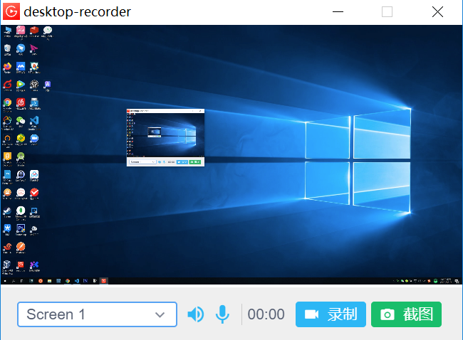

# Product Name
> A dead simple cross platform desktop recorder.


I create this project when I planning to teach javascript on [bilibili](https://www.bilibili.com/), I managed to find a simple desktop recorder but none of them are simple enough. After struggling for a few hours, I decided to reinvent this one.



## Installation

OS X & Linux & Windows(build your ownn):

```sh
yarn install && yarn buildApp
```

Or You can download binaries from [Release](https://github.com/skunight/desktop-recorder/releases) page

## Usage example

I don't have time to do this.

## Development setup

I don't have time to do this.

```sh
make install
npm test
```

## Release History

* 0.0.1
    * CHANGE: init


## Meta

skunight – [@bilibili](https://space.bilibili.com/406886404) – skunight@gmail.com

Distributed under the MIT license. See ``LICENSE.md`` for more information.

[https://github.com/skunight/desktop-recorder/blob/master/LICENSE.md](https://github.com/skunight/desktop-recorder/blob/master/LICENSE.md)

## Contributing

1. Fork it (<https://github.com/skunight/desktop-recorder/fork>)
2. Create your feature branch (`git checkout -b feature/funnyFeature`)
3. Commit your changes (`git commit -am 'Add some funny features'`)
4. Push to the branch (`git push origin feature/funnyFeature`)
5. Create a new Pull Request
